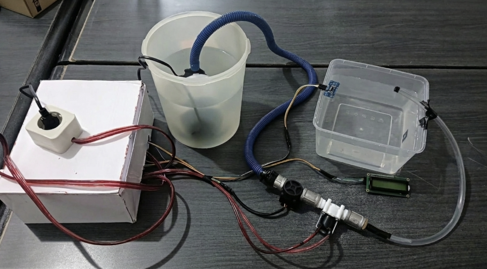
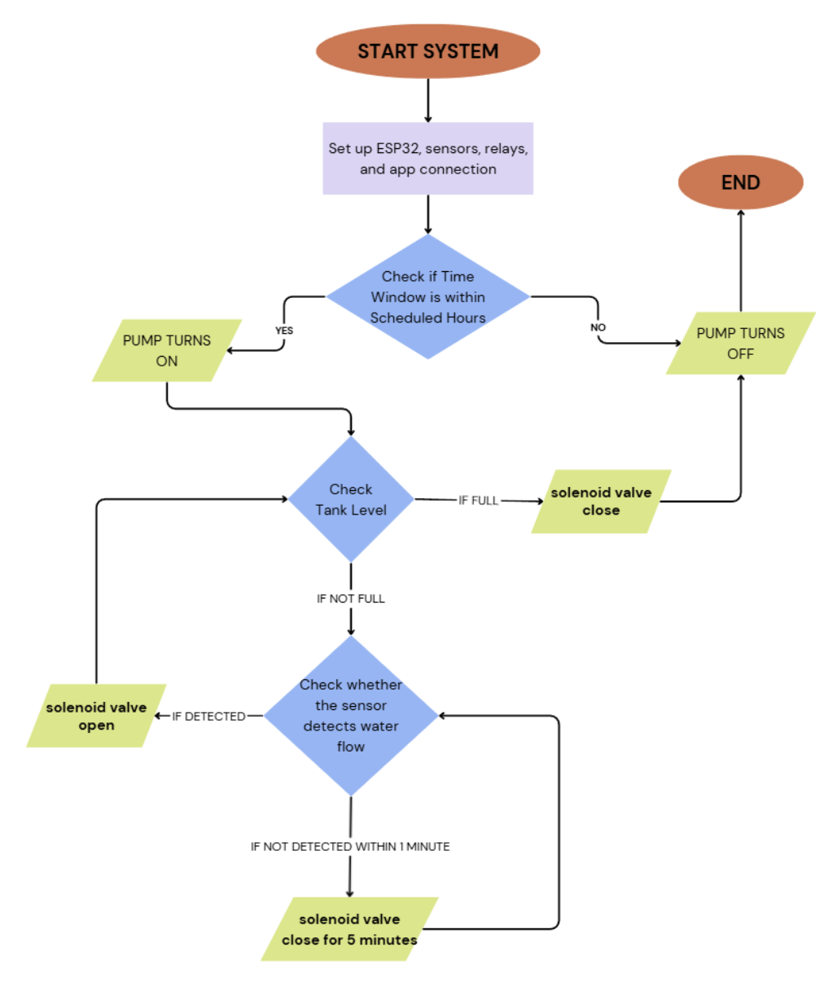
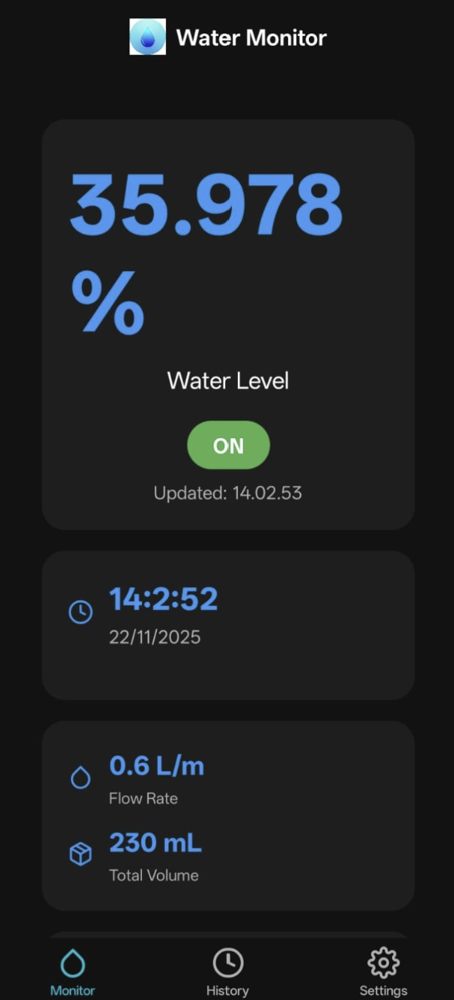
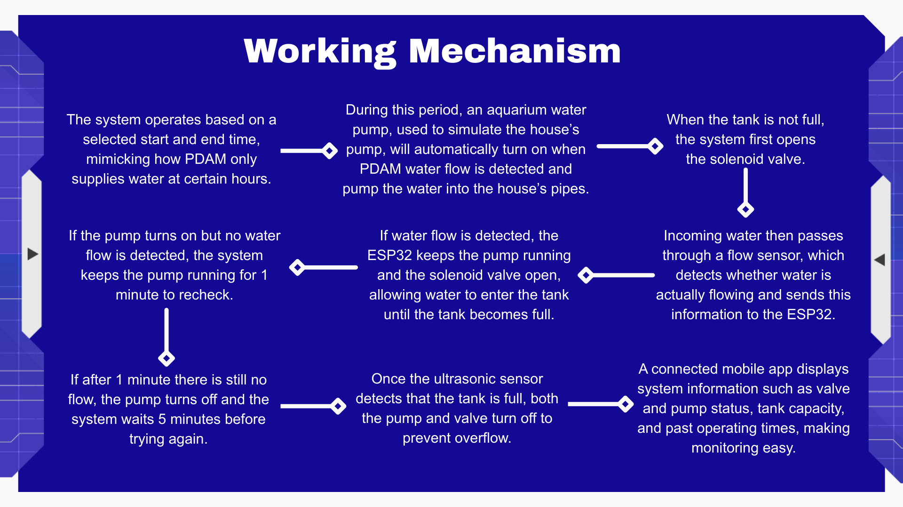

# Automatic Water Tank System

Automated water tank system that can detect when water is available and automatically store it in a household tank without any human intervention

## Brief Description
In Indonesia, the distribution of water to households managed by PDAM remains inefficient in many regions, still facing numerous obstacles related to delivery and stability. This cause many areas experience on and off water flow, resulting in citizens having to manually test their taps to see if water is running, often in the middle of the night, making it even more inconvenient.

## Main Features
- **Monitoring Water Level (Ultrasonic)**: Measure the distance level of water with stabilized accuracy (Moving Average Filter).
- **Monitoring Water Flow Rate (Water Flow Sensor)**: Monitor the flow rate (L/minute) and total accumulated volume of water entering.
- **IoT & Firebase**: Send water level, water flow rate, volume, and pump status data to Firebase Realtime Database.
- **Pump Operational Schedule**: The pump's active time can be scheduled and adjusted (start and end times) through NTP time synchronization and Firebase settings.
- **LCD Display**: Displays connection status, flow rate (Flow), and tank water level (Tank %) directly with LCD I2C (16x2).

## Hardware
- ESP32
- YF-S201 Water Flow Sensor
- 12V DC Straight Solenoid Automatic Water Valve
- HC-SR04 Ultrasonic Sensor
- 5V Relay (4-channel)
- Extension Cord
- 12V 5A Power Supply Adapter
- Mini Breadboard
- Jumper Wires
- Aquarium Pump
- 16x2 LCD I2C Display
- Plug
- Cables
- Hose

## Wi-Fi & Database Settings
This system requires configuration of the Wi-Fi name (SSID) and its password, as well as the Firebase Host URL and authentication secrets (Auth/Token) for IoT operations. This configuration can be adjusted within the main `.ino` file.

## Initial Prototype Sketch

## Prototype Software Logic

## The Mobile App Screen

Includes:
- Water Level (% of Tank)
- Pump Status (On/Off)
- Flow Rate (L/min)
- Tank Volume (L)
- Pump Operating Schedule
- Records previous operating times (History)
- Real-Time Clock

## Working Mechanism
